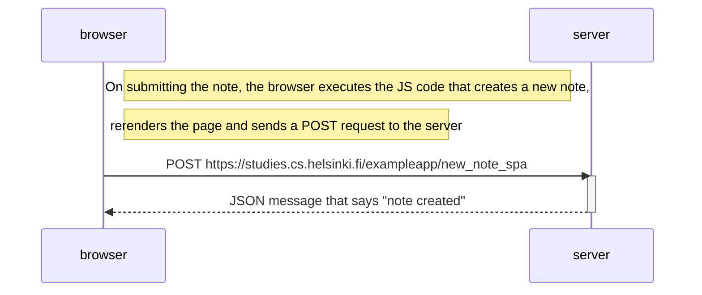

```mermaid
sequenceDiagram
    participant browser
    participant server

    Note right of browser: On submitting the note, the browser executes the JS code that creates a new note,
 
    Note right of browser:rerenders the page and sends a POST request to the server

    browser->>server: POST https://studies.cs.helsinki.fi/exampleapp/new_note_spa
    activate server
    server-->>browser: JSON message that says "note created"
    deactivate server
```